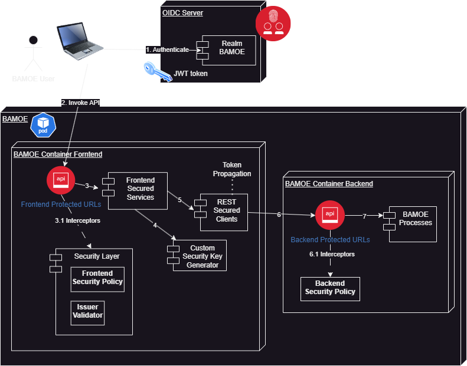
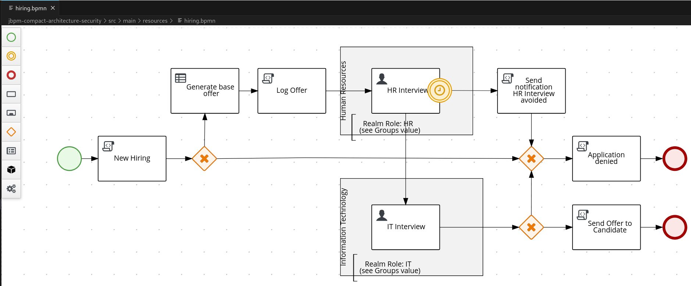
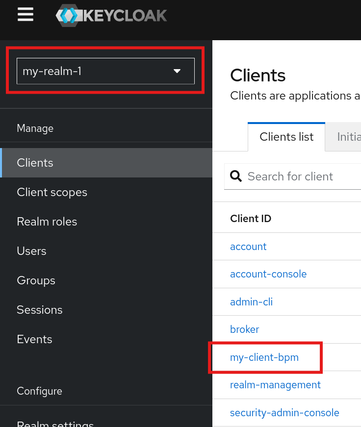
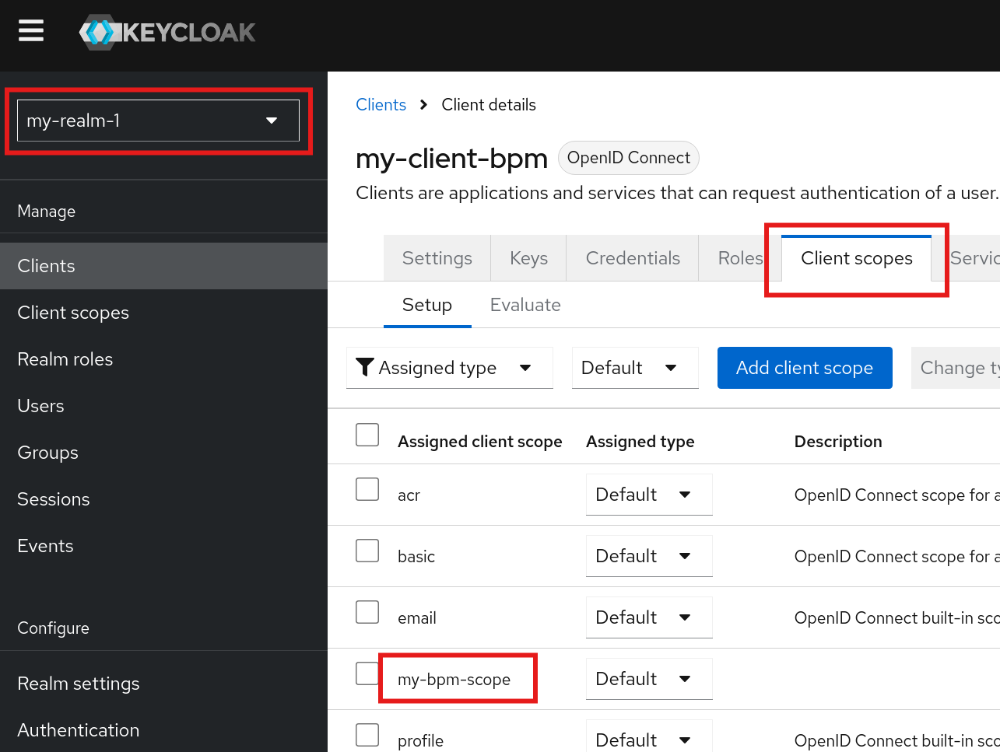
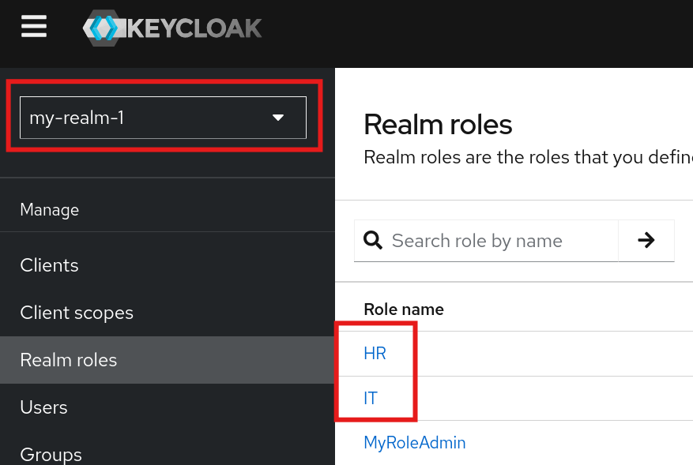
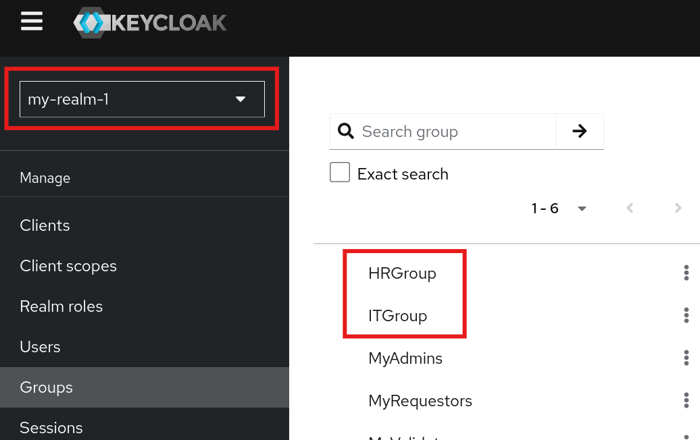
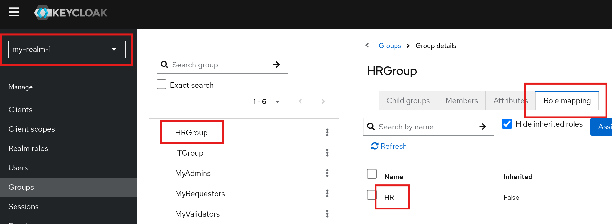

# BAMOE v9 process management using OIDC Authentication / Authorization (Keycloak JWT token)

PoT for client authentication and autorization for BAMOE v9 processes/tasks using Keycloak OIDC and JWT tokens

## PoT goals

The goal of this repository is to present a possible functional and architectural blueprint for the definition of a security layer dedicated to applications based on Kogito BPM.

In this scenario we will use the IBM BAMOE v9.1.1 distribution with the technology preview of BPMN processes.


## Security scenario

Kogito BPM and its APIs for interactions with human processes and tasks adopt an extremely permissive model, that is, they are based on the concept of self-declaration of the requester.

In technical terms, the APIs for interaction with human tasks accept a pair of parameters with which the requester declares the user-id and the list of roles to which the user is associated.

The architectural choice of the process and task management framework to externalize the security issue is not questioned and can be justified by the fact that in a cloud-native world, the implementations of security systems are multiple and based on various technologies that are not always interoperable; this means that the security layer for authentication and authorization is delegated externally and consequently each application solution will have to implement its own strategies and implementations.

## Architectural blueprint

In an architectural scenario based on micro-services concepts, the choice made for the security blueprint is to be as less invasive as possible with respect to the BPMN application that is to be created.

To keep the BPMN application as free as possible from external dependencies (other Quarkus extensions and any prerequisites of runtime versions) it was decided to externalize the standard REST transport protection layer on another container, making the most of the security potential applicable to the API and integration with external OIDC systems; in this example a Keycloak server will be used with a realm customized specifically for this scenario.

The blueprint defines the presence of two containers running in the same pod. The communication between the two containers is based on the ip address 127.0.0.1. The 'backend' container that will contain the BPMN application will not have http ports exposed to the Service but can only be reached by internal calls or by the 'frontend' container via ip 127.0.0.1. The 'frontend' container exposes custom and protected REST APIs that allow requests to be mediated towards the 'backend' container.




### BPMN application, 'backend' container (jbpm-compact-architecture-security)

<i>
NOTE:
This application is a copy of the 'jbpm-compact-architecture-example' example present in the 'bamoe-9.1.1-examples.zip' archive of the IBM BAMOE v9 distribution.
The 'HRInterview' and 'ITInterview' tasks have been adapted with the configuration of the user roles authorized to interact with these human-tasks.
</i>




Taking into account that the executable Java application code is automatically generated during the build phase starting from the BPMN model and that this must not be manually modified in any way, both to avoid blocking the CI/CD pipelines and to avoid losing the changes at each build, we chose to adopt a 'protection' approach of the BPMN application core.

A Java class '<b>MyBackendHttpSecPolicy</b>' that implements the interface is added to the BPMN application in a separate package

<b><code>io.quarkus.vertx.http.runtime.security.HttpSecurityPolicy</code></b>

This Java class will need to implement the method

<b>
<code>@Override

public Uni<CheckResult> checkPermission(RoutingContext routingContext, Uni<SecurityIdentity> identity, AuthorizationRequestContext requestContext)</code>
</b>

This method will perform a series of custom checks to authorize every single request that will be received for one or more BPMN processes; in this example for the process exposed on REST transport with the URI <b>"/hiring"</b>.

The file '<b>application.properties</b>' will contain a set of properties related to the http policy named '<b>backend</b>'

<b><code>quarkus.http.auth.permission.backend.{*}'</code></b>

These properties define the behavior of the custom policy.

In this example the policy performs (based on configuration):

1. checking the IP of origin of the request
2. checking the presence and verification of an http header that identifies a service-key
3. checking the presence of the http header 'Authorization' with JWT Bearer token on which both the client-id with which the OIDC server created the token in question and the scope associated with the client-id are necessarily verified.

These three checks are a simple example of how to create a security enforcement for request authorization.

### BPMN security enforcement, 'frontend' container (jbpm-frontend-jwt-security)

This application defines a set of REST APIs protected with JWT tokens.

The example scenario does not implement an exhaustive set of process and task management APIs, it is limited to a fully functional subset that allows you to start processes and interact with human-tasks.

These APIs simplify the integration towards the 'backend' layer regarding the authentication and authorization theme both technologically and applicatively.

These APIs are associated with a custom http authorization policy '<b>MyFrontendHttpSecPolicy</b>' implementing the interface

<b><code>io.quarkus.vertx.http.runtime.security.HttpSecurityPolicy</code></b>

and a custom JWT issuer validator '<b>MyIssuerValidator</b>'  implementing the interface

<b><code>org.jose4j.jwt.consumer.Validator</code></b>

The Java code in the '<b>frontend</b>' application is process-agnostic and can be reused for any BPMN process. All key elements are identified by rest-query parameters.

The main purpose of this layer, in addition to implementing OIDC and JWT token-based security, is to extract from the JWT token the user-name and the roles associated with it in the realm on which the user was authenticated and for which the token was issued.

With these automatic user and role mapping features, a serious and solid security layer is created that identifies the user and his roles in a guaranteed way.

### Customized Keycloak realm

In the application 'jbpm-frontend-jwt-security' there is a json archive 'my-realm-1-realm.json' for a custom realm named <b>'my-realm-1'</b>.

In this realm the following were defined:

1. A client dedicated to the BPM scenario
2. Two HR and IT roles for human-tasks
3. Two user groups HRGroup and ITGroup to register the users, each group is associated with the relative role

#### Client Configuration

Client name: <b>my-client-bpm</b>



Client scope: <b>my-bpm-scope</b>




#### Realm Roles Configuration

Realm Roles: <b>HR</b>, <b>IT</b>




#### Group Configuration

Groups: <b>HRGroup</b>, <b>ITGroup</b>



Groups to Roles mapping: <b>HRGroup</b>, <b>ITGroup</b>



Users in group HRGroup (role HR): <b>alice</b>, <b>mary</b>

Users in group ITGroup (role IT): <b>john</b>, <b>marco</b>

##### Create your new Realm

If you want to create a test realm with your configurations you can use this simple tool 
<a href="https://github.com/marcoantonioni/keycloak-postgres-compose" target="_blank">https://github.com/marcoantonioni/keycloak-postgres-compose</a>

The tool uses the version tagged 'latest' and has a configuration attribute that is not compatible with the Keycloak version used by Quarkus DevServices when preparing this PoT.
You can remove the blocking tag with the following command:

```
sed -i 's/"bruteForceStrategy" : "MULTIPLE",//g' ./YOUR-REALM-FILE.json
```


#### JWT Token structure

The token that is issued by Keycloak upon login has the following structure and attributes:
<pre>
{
  "access_token": "eyJhbGci.......HRPcCOaTVgeXw",
  "expires_in": 14400,
  "refresh_expires_in": 1800,
  "refresh_token": "eyJhbGciOiJIUzUx........6oZGLEBf7GDL8ZUdG1w",
  "token_type": "Bearer",
  "id_token": "eyJhbGciOi.........coosgBAgaRUm34cfVeZJw",
  "not-before-policy": 0,
  "session_state": "e9fcaf93-dd0a-4cce-8c3a-64cd3f2b9c1b",
  "scope": "openid profile email my-bpm-scope"
}
</pre>

To interact with protected APIs, the value of the '<b>access_token</b>' attribute is used.

In turn, this value defines a further json structure that can be revealed for example via the site <a href="https://jwt.io" target="_blank">https://jwt.io</a>

An example is the following for a login performed with the credentials of the user 'alice', let's see the three sections:

HEADER:ALGORITHM & TOKEN TYPE
<pre>
{
  "alg": "RS256",
  "typ": "JWT",
  "kid": "yS2j6SWGjuvXSoxZ_mTAPhp87IbTIcef5Vb6X6EG-ds"
}
</pre>

PAYLOAD:DATA
<pre>
{
  "exp": 1734872738,
  "iat": 1734858338,
  "jti": "3789159c-743c-4921-a166-652eb421ff4a",
  <b><i>"iss"</i></b>: "http://localhost:44444/realms/my-realm-1",
  "aud": "account",
  "sub": "2acc41df-e89a-4d31-a7ea-04281b018936",
  "typ": "Bearer",
  <b><i>"azp"</i></b>: "my-client-bpm",
  "sid": "5338aabc-65d3-4859-be79-ae52ffabfec1",
  "acr": "1",
  "realm_access": {
    <b><i>"roles"</i></b>: [
      "MyRoleViewer",
      "offline_access",
      <b><i>"HR"</i></b>,
      "uma_authorization",
      "default-roles-my-realm-1"
    ]
  },
  "resource_access": {
    "account": {
      "roles": [
        "manage-account",
        "manage-account-links",
        "view-profile"
      ]
    }
  },
  <b><i>"scope"</i></b>: "openid profile email my-bpm-scope",
  "email_verified": false,
  "name": "alice alice",
  "preferred_username": "alice",
  <b><i>"given_name"</i></b>: "alice",
  "family_name": "alice",
  "email": "alice@home.net"
}
</pre>

VERIFY SIGNATURE
<pre>
RSASHA256(
  base64UrlEncode(header) + "." +
  base64UrlEncode(payload),
.......
</pre>

The most interesting section for this scenario is <b>PAYLOAD:DATA</b>.

This section contains the attributes related to the username, the roles associated with it and a series of information that allow you to trace from which server, with which client-id and which purposes have been configured for this token.

The values ​​related to the user and its roles will be dynamically taken from the 'frontend' APIs and used for downstream invocations towards the BPM application.

As you can see the user 'alice' belongs to role 'HR'.

The values ​​related to the user and roles are readjusted based on the signature of the APIs exposed by the application for the process domain.

For example, the Java class automatically generated for the execution of the 'hiring' process defines among many the method <b>completeTask_HRInterview_0</b> that works for human task 'HRInterview'.

<pre>
    @POST
    @Path("/{id}/HRInterview/{taskId}")
    @Consumes(MediaType.APPLICATION_JSON)
    @Produces(MediaType.APPLICATION_JSON)
    public HiringModelOutput <b>completeTask_HRInterview_0</b>(
          @PathParam("id") final String id, 
          @PathParam("taskId") final String taskId, 
          @QueryParam("phase") @DefaultValue("complete") final String phase, 
          @QueryParam("user") final String user, 
          @QueryParam("group") final List<String> groups, 
          final org.kie.kogito.hr.Hiring__B8C4F63C_81AD_4291_9C1B_84967277EEF6_TaskOutput model) {
        return processService.taskTransition(process, id, taskId, phase, SecurityPolicy.of(user, groups), model).orElseThrow(NotFoundException::new);
    }
</pre>

The frontend APIs readjust the list of roles read from the JWT token and through a POST operation with a series of parameters named 'group' each of which contains the value of one of the roles present in the token. 

In this way the frontend APIs ensure that the interactions towards the process APIs are invoked in complete safety at least for users and roles present in the token.

## Blueprint solution known limits

This repository should be considered an example from which to start to create proprietary solutions that will implement all the security policies that are required in your environments.

No performance analysis has been performed.

No scalability analysis of the solution has been performed.

<b><i>
The application code present in this repository is purely for example purposes and SHOULD NOT be used in production environments.

Any use in whole or in part is at your own risk.
</i></b>

## Run the demo

To run the demo you need a set of requirements that you can find at https://www.ibm.com/docs/en/ibamoe/9.1.x?topic=installing

Instructions to run a test:

### Frontend application
Open a first shell in the folder 'jbpm-frontend-jwt-security' and run the command <pre>quarkus dev</pre>

The Quarkus dev-services start a Keycloak container based on 'quay.io/keycloak/keycloak:25.0.6' according to dependency.

This Keycloak server is configured on port 44444 with custom realm defined in 'my-realm-1-realm.json'.

The dev-ui is at the link http://localhost:8880/q/dev-ui/extensions

See 'application.properties' file
<pre>
quarkus.keycloak.devservices.realm-path=my-realm-1-realm.json
quarkus.keycloak.devservices.port=44444

quarkus.http.port=8880
</pre>

### Backend application
Open a second shell in the folder 'jbpm-compact-architecture-security' and run the command <pre>quarkus dev</pre>

The Quarkus dev-services start a Postgres container based on 'docker.io/library/postgres:14' according to dependency.

The dev-ui is at the link http://localhost:8080/q/dev-ui/extensions

With security policies enabled (in this case also in DEV profile) the process management console 'jBPM Quarkus Dev UI' cannot work.
In 'Developer Tools' of your browser the error is
<pre>
Request URL:
http://localhost:8080/graphql
Request Method:
POST
Status Code:
403 Forbidden
Remote Address:
[::1]:8080
Referrer Policy:
strict-origin-when-cross-origin
</pre>

Our security protection is working fine !

Now let's continue the tests using 'curl' to trigger the various features.

The token and tasks can expire, in case of empty result of the 'curl' command use the -v flag instead of -s to have the details of the operation.

### 1. Login to Keycloak and grab a JWT token
```
# token for HR user 
# run all the following commands to get the service token in KC_TOKEN (from .access_token attribute)

KC_PORT=44444
KC_REALM=my-realm-1
KC_CLIENT_USER=my-client-bpm
KC_CLIENT_SECRET=my-secret-bpm
USER_NAME=alice
USER_PWD=alice
KC_TOKEN_EXPIRATION=""
KC_TOKEN_SCOPE=""

# login
KC_FULL_TOKEN=$(curl -sk -X POST http://localhost:${KC_PORT}/realms/${KC_REALM}/protocol/openid-connect/token \
  --user ${KC_CLIENT_USER}:${KC_CLIENT_SECRET} -H 'content-type: application/x-www-form-urlencoded' \
  -d 'username='${USER_NAME}'&password='${USER_PWD}'&grant_type=password&scope=openid')

if ([[ ! -z "${KC_FULL_TOKEN}" ]] && [[ "${KC_FULL_TOKEN}" != "null" ]]) then echo "Logged in"; else echo "Not logged in"; fi

if ([[ ! -z "${KC_FULL_TOKEN}" ]] && [[ "${KC_FULL_TOKEN}" != "null" ]]) then KC_TOKEN=$(echo "${KC_FULL_TOKEN}" | jq '.access_token' | sed 's/"//g'); else KC_TOKEN=""; fi

if ([[ ! -z "${KC_FULL_TOKEN}" ]] && [[ "${KC_FULL_TOKEN}" != "null" ]]) then KC_TOKEN_EXPIRATION=$(echo $KC_FULL_TOKEN | jq .expires_in | sed 's/"//g'); fi

if ([[ ! -z "${KC_FULL_TOKEN}" ]] && [[ "${KC_FULL_TOKEN}" != "null" ]]) then KC_TOKEN_SCOPE=$(echo $KC_FULL_TOKEN | jq .scope | sed 's/"//g'); fi

echo "Token expires in: ${KC_TOKEN_EXPIRATION}"
echo "Token scopes: ${KC_TOKEN_SCOPE}"

```

This is an example of KC_FULL_TOKEN content

echo $KC_FULL_TOKEN | jq .

<pre>
{
  "access_token": "eyJhbGci.......HRPcCOaTVgeXw",
  "expires_in": 14400,
  "refresh_expires_in": 1800,
  "refresh_token": "eyJhbGciOiJIUzUx........6oZGLEBf7GDL8ZUdG1w",
  "token_type": "Bearer",
  "id_token": "eyJhbGciOi.........coosgBAgaRUm34cfVeZJw",
  "not-before-policy": 0,
  "session_state": "e9fcaf93-dd0a-4cce-8c3a-64cd3f2b9c1b",
  "scope": "openid profile email my-bpm-scope"
}
</pre>

### 2. Start a process instance

The 'frontend' application exposes REST API on path '/bamoe'

As from configuration only users belonging to 'HR' role can start process instances. So 'alice' is authorized.
<pre>
# list of roles authorized to start a process instance
# last key segment must be equal to process name
marco.bamoe.process-starter-roles.hiring=HR
</pre>

```
_PROCESS_NAME=hiring

INSTANCE_RESULT=$(curl -s -H "Content-Type: application/json" -H "Accept: application/json" -H "Authorization: Bearer "${KC_TOKEN} \
  -X POST http://localhost:8880/bamoe/process-instances/${_PROCESS_NAME} \
    -d '{"candidateData": { "name": "Jon", "lastName": "Snow", "email": "jon@snow.org", "experience": 5, "skills": ["Java", "Kogito", "Fencing"]}}' )
    
echo ${INSTANCE_RESULT} | jq .
_PROC_ID=$(echo ${INSTANCE_RESULT} | jq .id | sed 's/"//g')
echo "new instance id: "${_PROC_ID}
```

Now try the same command with verbose flag -v and without the 'Authorization' header or with fake value

this MUST fail
```
curl -v -H "Content-Type: application/json" -H "Accept: application/json" -H "Authorization: Bearer XYZ" \
  -X POST http://localhost:8880/bamoe/process-instances/${_PROCESS_NAME} \
    -d '{"candidateData": { "name": "Jon", "lastName": "Snow", "email": "jon@snow.org", "experience": 5, "skills": ["Java", "Kogito", "Fencing"]}}'
```

the error is '401 Unauthorized' and text should be similar to
<pre>
> POST /bamoe/process-instances/hiring HTTP/1.1
> Host: localhost:8880
> User-Agent: curl/7.76.1
> Content-Type: application/json
> Accept: application/json
> Authorization: Bearer XYZ
> Content-Length: 138
> 
* Mark bundle as not supporting multiuse
< HTTP/1.1 401 Unauthorized
< www-authenticate: Bearer
< content-length: 0
< 
* Connection #0 to host localhost left intact
</pre>

Now login with user 'john' and try to start a process instance.
```
USER_NAME=john
USER_PWD=john

KC_PORT=44444
KC_REALM=my-realm-1
KC_CLIENT_USER=my-client-bpm
KC_CLIENT_SECRET=my-secret-bpm
KC_TOKEN_EXPIRATION=""
KC_TOKEN_SCOPE=""
KC_FULL_TOKEN=$(curl -sk -X POST http://localhost:${KC_PORT}/realms/${KC_REALM}/protocol/openid-connect/token \
  --user ${KC_CLIENT_USER}:${KC_CLIENT_SECRET} -H 'content-type: application/x-www-form-urlencoded' \
  -d 'username='${USER_NAME}'&password='${USER_PWD}'&grant_type=password&scope=openid')
if ([[ ! -z "${KC_FULL_TOKEN}" ]] && [[ "${KC_FULL_TOKEN}" != "null" ]]) then echo "Logged in"; else echo "Not logged in"; fi
if ([[ ! -z "${KC_FULL_TOKEN}" ]] && [[ "${KC_FULL_TOKEN}" != "null" ]]) then KC_TOKEN=$(echo "${KC_FULL_TOKEN}" | jq '.access_token' | sed 's/"//g'); else KC_TOKEN=""; fi
if ([[ ! -z "${KC_FULL_TOKEN}" ]] && [[ "${KC_FULL_TOKEN}" != "null" ]]) then KC_TOKEN_EXPIRATION=$(echo $KC_FULL_TOKEN | jq .expires_in | sed 's/"//g'); fi
if ([[ ! -z "${KC_FULL_TOKEN}" ]] && [[ "${KC_FULL_TOKEN}" != "null" ]]) then KC_TOKEN_SCOPE=$(echo $KC_FULL_TOKEN | jq .scope | sed 's/"//g'); fi
echo "Token expires in: ${KC_TOKEN_EXPIRATION}"
echo "Token scopes: ${KC_TOKEN_SCOPE}"
```

try to start a process instance, this MUST fail
```
curl -v -H "Content-Type: application/json" -H "Accept: application/json" -H "Authorization: Bearer "${KC_TOKEN} \
  -X POST http://localhost:8880/bamoe/process-instances/${_PROCESS_NAME} \
    -d '{"candidateData": { "name": "Jon", "lastName": "Snow", "email": "jon@snow.org", "experience": 5, "skills": ["Java", "Kogito", "Fencing"]}}'
```

the error is '403 Forbidden' and text should be similar to
<pre>
> Content-Length: 138
> 
* Mark bundle as not supporting multiuse
< HTTP/1.1 403 Forbidden
< content-length: 0
< 
* Connection #0 to host localhost left intact
</pre>

### 3. Get a list of process instances

Login again with user 'alice', he has the role granted to interact with first human-tak in the process.

Then run the following requests

```
# get the list of process instances
curl -s -H "Authorization: Bearer "${KC_TOKEN} -X GET http://localhost:8880/bamoe/process-instances/${_PROCESS_NAME} | jq .
```

Then copy the value of an process instance id and set into _PROC_ID variable.

For example
```
_PROC_ID=9824a8d9-f611-4cfc-af0c-96a1426e309d

# get the details of an instance
curl -s -H "Authorization: Bearer "${KC_TOKEN} -X GET http://localhost:8880/bamoe/process-data/${_PROCESS_NAME}/${_PROC_ID} | jq .
```

```
# get the tasks list for an instance
_PROC_ID=9824a8d9-f611-4cfc-af0c-96a1426e309d
curl -s -H "Authorization: Bearer "${KC_TOKEN} -X GET http://localhost:8880/bamoe/task-list/${_PROCESS_NAME}/${_PROC_ID} | jq .
```

### 3. Get a list of tasks for a process instances

Then copy the value of id for an HRInterview task instance into TASK_ID variable.

```
# get task details
_PROC_ID=9824a8d9-f611-4cfc-af0c-96a1426e309d
TASK_ID=748ec1f8-3d72-410a-a54b-309d0a5704cd
TASK_NAME=HRInterview

curl -s -H "Authorization: Bearer "${KC_TOKEN} -X GET http://localhost:8880/bamoe/task-instance/${_PROCESS_NAME}/${_PROC_ID}/${TASK_NAME}/${TASK_ID} | jq .
```

### 4. Claim a tasks

Continue to use the shell environment variable values used in previous step.

```
curl -s -H "Content-Type: application/json" -H "Accept: application/json" -H "Authorization: Bearer "${KC_TOKEN} -X POST http://localhost:8880/bamoe/task-claim/${_PROCESS_NAME}/${_PROC_ID}/${TASK_NAME}/${TASK_ID} | jq .
```

now read again the details of the same task 

```
curl -s -H "Authorization: Bearer "${KC_TOKEN} -X GET http://localhost:8880/bamoe/task-instance/${_PROCESS_NAME}/${_PROC_ID}/${TASK_NAME}/${TASK_ID} | jq .
```

note that the task status has now changed from

<pre>
  "phase": "active",
  "phaseStatus": "Ready",
</pre>

to 

<pre>
  "phase": "claim",
  "phaseStatus": "Reserved",
</pre>

### 5. Complete a task

Continue to use the shell environment variable values used in previous step.

```
# complete task
curl -s -H "Content-Type: application/json" -H "Accept: application/json" -H "Authorization: Bearer "${KC_TOKEN} -X POST http://localhost:8880/bamoe/task-complete/${_PROCESS_NAME}/${_PROC_ID}/${TASK_NAME}/${TASK_ID} \
-d '{
  "offer": {
    "category": "Very Old Senior Software Engineer",
    "salary": 99999
  },
  "candidate": {
    "name": "Jon",
    "lastName": "Snow",
    "email": "jon@snow.org",
    "experience": 5,
    "skills": [
      "Java",
      "Kogito",
      "Fencing"
    ]
  },
  "approve": true
}' | jq .

```

Now the task is completed, login with user 'john' and repeat the same task steps to complete the 'ITInterview' human-task. 

Use 'ITInterview' value
```
TASK_NAME=ITInterview
```

## References

https://www.ibm.com/docs/en/ibamoe/9.1.x

https://www.ibm.com/docs/en/ibamoe/9.1.x?topic=technology-preview-developing-process-services
