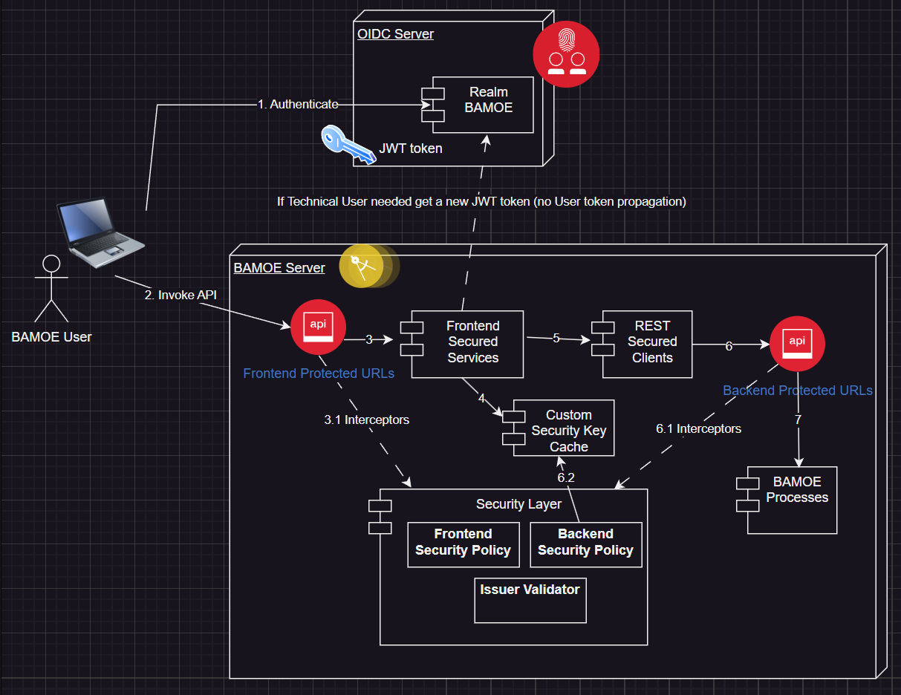

# bamoe9-process-jwt-security

# Sample description
<pre>
This example describes the access scenario to a backend service exposed via REST API and protected with JWT token (via Keycloak).
The backend service is profiled for roles (defined in Keycloak) and for simple authenticated user.
The backend service is exposed via direct URIs and via protected and unprotected mediation URIs.
The mediation URIs use a technical user (via oidc client) configured in the application and that is used to access the backend services.
</pre>

## Keycloak realm configuration
> **_Removed attribute_** "bruteForceStrategy" : "MULTIPLE"


```
```

## System diagram


This is an architectural overview

## Refs
<pre>
https://permify.co/post/top-open-source-keycloak-alternatives/
</pre>